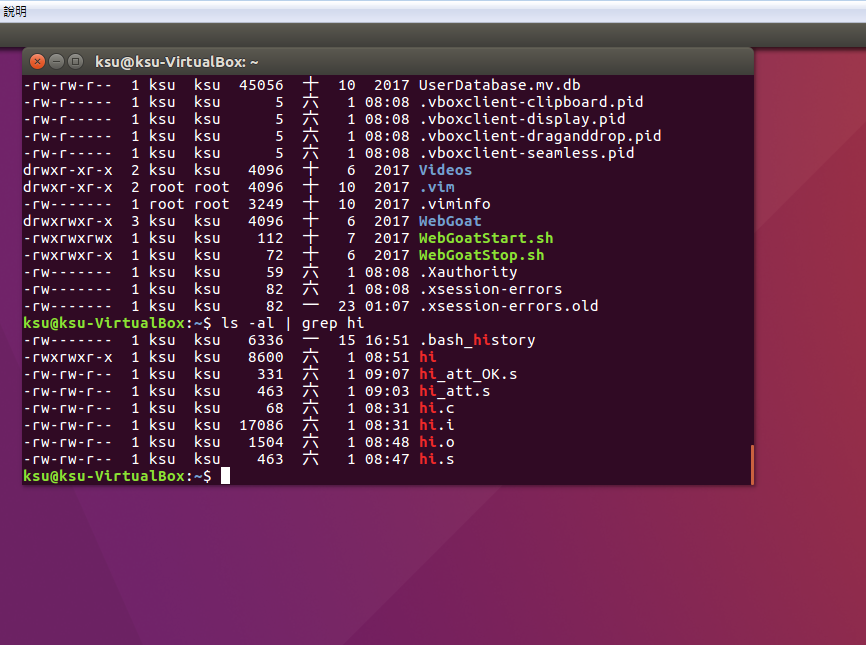
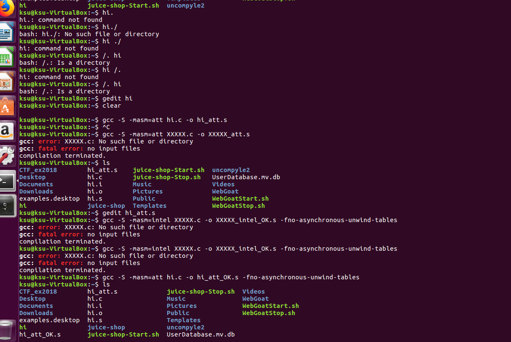
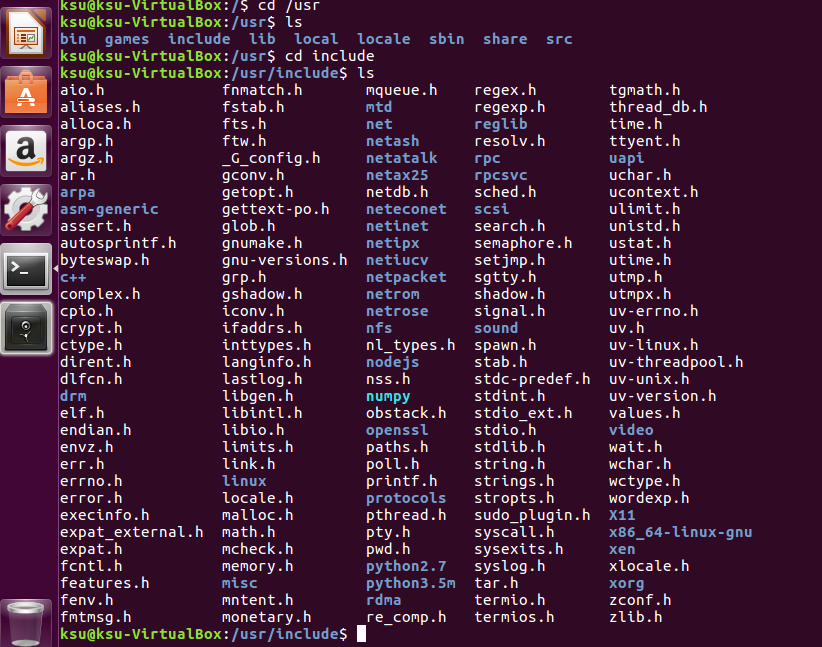

c語言程式編譯與組譯
產生組語

範例c程式
```
#include <stdio.h>

int main()
{
   printf("hi\n ”);
   return 0;
}
```
預處理階段:
gcc –E hi.c –o hi.i
```
# 1 "hi.c"
# 1 "<built-in>"
# 1 "<command-line>"
# 1 "/usr/include/stdc-predef.h" 1 3 4
# 1 "<command-line>" 2
# 1 "hi.c"
# 1 "/usr/include/stdio.h" 1 3 4
# 27 "/usr/include/stdio.h" 3 4
# 1 "/usr/include/features.h" 1 3 4
# 367 "/usr/include/features.h" 3 4
# 1 "/usr/include/x86_64-linux-gnu/sys/cdefs.h" 1 3 4
# 410 "/usr/include/x86_64-linux-gnu/sys/cdefs.h" 3 4
# 1 "/usr/include/x86_64-linux-gnu/bits/wordsize.h" 1 3 4
# 411 "/usr/include/x86_64-linux-gnu/sys/cdefs.h" 2 3 4
# 368 "/usr/include/features.h" 2 3 4
# 391 "/usr/include/features.h" 3 4
# 1 "/usr/include/x86_64-linux-gnu/gnu/stubs.h" 1 3 4
# 10 "/usr/include/x86_64-linux-gnu/gnu/stubs.h" 3 4
# 1 "/usr/include/x86_64-linux-gnu/gnu/stubs-64.h" 1 3 4
# 11 "/usr/include/x86_64-linux-gnu/gnu/stubs.h" 2 3 4
# 392 "/usr/include/features.h" 2 3 4
# 28 "/usr/include/stdio.h" 2 3 4


# 1 "/usr/lib/gcc/x86_64-linux-gnu/5/include/stddef.h" 1 3 4
# 216 "/usr/lib/gcc/x86_64-linux-gnu/5/include/stddef.h" 3 4

# 216 "/usr/lib/gcc/x86_64-linux-gnu/5/include/stddef.h" 3 4
typedef long unsigned int size_t;
# 34 "/usr/include/stdio.h" 2 3 4

# 1 "/usr/include/x86_64-linux-gnu/bits/types.h" 1 3 4
# 27 "/usr/include/x86_64-linux-gnu/bits/types.h" 3 4
# 1 "/usr/include/x86_64-linux-gnu/bits/wordsize.h" 1 3 4
# 28 "/usr/include/x86_64-linux-gnu/bits/types.h" 2 3 4


typedef unsigned char __u_char;
typedef unsigned short int __u_short;
typedef unsigned int __u_int;
typedef unsigned long int __u_long;


typedef signed char __int8_t;
typedef unsigned char __uint8_t;
typedef signed short int __int16_t;
typedef unsigned short int __uint16_t;
typedef signed int __int32_t;
typedef unsigned int __uint32_t;

typedef signed long int __int64_t;
typedef unsigned long int __uint64_t;


typedef long int __quad_t;
typedef unsigned long int __u_quad_t;
# 121 "/usr/include/x86_64-linux-gnu/bits/types.h" 3 4
# 1 "/usr/include/x86_64-linux-gnu/bits/typesizes.h" 1 3 4
# 122 "/usr/include/x86_64-linux-gnu/bits/types.h" 2 3 4


typedef unsigned long int __dev_t;
typedef unsigned int __uid_t;
typedef unsigned int __gid_t;
typedef unsigned long int __ino_t;
typedef unsigned long int __ino64_t;
typedef unsigned int __mode_t;
typedef unsigned long int __nlink_t;
typedef long int __off_t;
typedef long int __off64_t;
typedef int __pid_t;
typedef struct { int __val[2]; } __fsid_t;
typedef long int __clock_t;
typedef unsigned long int __rlim_t;
typedef unsigned long int __rlim64_t;
typedef unsigned int __id_t;
typedef long int __time_t;
typedef unsigned int __useconds_t;
typedef long int __suseconds_t;

typedef int __daddr_t;
typedef int __key_t;


typedef int __clockid_t;


typedef void * __timer_t;


typedef long int __blksize_t;


typedef long int __blkcnt_t;
typedef long int __blkcnt64_t;


typedef unsigned long int __fsblkcnt_t;
typedef unsigned long int __fsblkcnt64_t;


typedef unsigned long int __fsfilcnt_t;
typedef unsigned long int __fsfilcnt64_t;


typedef long int __fsword_t;

typedef long int __ssize_t;


typedef long int __syscall_slong_t;

typedef unsigned long int __syscall_ulong_t;


typedef __off64_t __loff_t;
typedef __quad_t *__qaddr_t;
typedef char *__caddr_t;


typedef long int __intptr_t;


typedef unsigned int __socklen_t;
# 36 "/usr/include/stdio.h" 2 3 4
# 44 "/usr/include/stdio.h" 3 4
struct _IO_FILE;


typedef struct _IO_FILE FILE;


# 64 "/usr/include/stdio.h" 3 4
typedef struct _IO_FILE __FILE;
# 74 "/usr/include/stdio.h" 3 4
# 1 "/usr/include/libio.h" 1 3 4
# 31 "/usr/include/libio.h" 3 4
# 1 "/usr/include/_G_config.h" 1 3 4
# 15 "/usr/include/_G_config.h" 3 4
# 1 "/usr/lib/gcc/x86_64-linux-gnu/5/include/stddef.h" 1 3 4
# 16 "/usr/include/_G_config.h" 2 3 4


# 1 "/usr/include/wchar.h" 1 3 4
# 82 "/usr/include/wchar.h" 3 4
typedef struct
{
  int __count;
  union
  {

    unsigned int __wch;


    char __wchb[4];
  } __value;
} __mbstate_t;
# 21 "/usr/include/_G_config.h" 2 3 4
typedef struct
{
  __off_t __pos;
  __mbstate_t __state;
} _G_fpos_t;
typedef struct
{
  __off64_t __pos;
  __mbstate_t __state;
} _G_fpos64_t;
# 32 "/usr/include/libio.h" 2 3 4
# 49 "/usr/include/libio.h" 3 4
# 1 "/usr/lib/gcc/x86_64-linux-gnu/5/include/stdarg.h" 1 3 4
# 40 "/usr/lib/gcc/x86_64-linux-gnu/5/include/stdarg.h" 3 4
typedef __builtin_va_list __gnuc_va_list;
# 50 "/usr/include/libio.h" 2 3 4
# 144 "/usr/include/libio.h" 3 4
struct _IO_jump_t; struct _IO_FILE;


typedef void _IO_lock_t;


struct _IO_marker {
  struct _IO_marker *_next;
  struct _IO_FILE *_sbuf;


  int _pos;
# 173 "/usr/include/libio.h" 3 4
};


enum __codecvt_result
{
  __codecvt_ok,
  __codecvt_partial,
  __codecvt_error,
  __codecvt_noconv
};
# 241 "/usr/include/libio.h" 3 4
struct _IO_FILE {
  int _flags;


  char* _IO_read_ptr;
  char* _IO_read_end;
  char* _IO_read_base;
  char* _IO_write_base;
  char* _IO_write_ptr;
  char* _IO_write_end;
  char* _IO_buf_base;
  char* _IO_buf_end;

  char *_IO_save_base;
  char *_IO_backup_base;
  char *_IO_save_end;

  struct _IO_marker *_markers;

  struct _IO_FILE *_chain;

  int _fileno;


  int _flags2;

  __off_t _old_offset;


  unsigned short _cur_column;
  signed char _vtable_offset;
  char _shortbuf[1];


  _IO_lock_t *_lock;
# 289 "/usr/include/libio.h" 3 4
  __off64_t _offset;


  void *__pad1;
  void *__pad2;
  void *__pad3;
  void *__pad4;

  size_t __pad5;
  int _mode;

  char _unused2[15 * sizeof (int) - 4 * sizeof (void *) - sizeof (size_t)];

};


typedef struct _IO_FILE _IO_FILE;


struct _IO_FILE_plus;

extern struct _IO_FILE_plus _IO_2_1_stdin_;
extern struct _IO_FILE_plus _IO_2_1_stdout_;
extern struct _IO_FILE_plus _IO_2_1_stderr_;
# 333 "/usr/include/libio.h" 3 4
typedef __ssize_t __io_read_fn (void *__cookie, char *__buf, size_t __nbytes);


typedef __ssize_t __io_write_fn (void *__cookie, const char *__buf,
     size_t __n);


typedef int __io_seek_fn (void *__cookie, __off64_t *__pos, int __w);


typedef int __io_close_fn (void *__cookie);
# 385 "/usr/include/libio.h" 3 4
extern int __underflow (_IO_FILE *);
extern int __uflow (_IO_FILE *);
extern int __overflow (_IO_FILE *, int);
# 429 "/usr/include/libio.h" 3 4
extern int _IO_getc (_IO_FILE *__fp);
extern int _IO_putc (int __c, _IO_FILE *__fp);
extern int _IO_feof (_IO_FILE *__fp) __attribute__ ((__nothrow__ , __leaf__));
extern int _IO_ferror (_IO_FILE *__fp) __attribute__ ((__nothrow__ , __leaf__));

extern int _IO_peekc_locked (_IO_FILE *__fp);


extern void _IO_flockfile (_IO_FILE *) __attribute__ ((__nothrow__ , __leaf__));
extern void _IO_funlockfile (_IO_FILE *) __attribute__ ((__nothrow__ , __leaf__));
extern int _IO_ftrylockfile (_IO_FILE *) __attribute__ ((__nothrow__ , __leaf__));
# 459 "/usr/include/libio.h" 3 4
extern int _IO_vfscanf (_IO_FILE * __restrict, const char * __restrict,
   __gnuc_va_list, int *__restrict);
extern int _IO_vfprintf (_IO_FILE *__restrict, const char *__restrict,
    __gnuc_va_list);
extern __ssize_t _IO_padn (_IO_FILE *, int, __ssize_t);
extern size_t _IO_sgetn (_IO_FILE *, void *, size_t);

extern __off64_t _IO_seekoff (_IO_FILE *, __off64_t, int, int);
extern __off64_t _IO_seekpos (_IO_FILE *, __off64_t, int);

extern void _IO_free_backup_area (_IO_FILE *) __attribute__ ((__nothrow__ , __leaf__));
# 75 "/usr/include/stdio.h" 2 3 4


typedef __gnuc_va_list va_list;
# 90 "/usr/include/stdio.h" 3 4
typedef __off_t off_t;
# 102 "/usr/include/stdio.h" 3 4
typedef __ssize_t ssize_t;


typedef _G_fpos_t fpos_t;


# 164 "/usr/include/stdio.h" 3 4
# 1 "/usr/include/x86_64-linux-gnu/bits/stdio_lim.h" 1 3 4
# 165 "/usr/include/stdio.h" 2 3 4


extern struct _IO_FILE *stdin;
extern struct _IO_FILE *stdout;
extern struct _IO_FILE *stderr;


extern int remove (const char *__filename) __attribute__ ((__nothrow__ , __leaf__));

extern int rename (const char *__old, const char *__new) __attribute__ ((__nothrow__ , __leaf__));


extern int renameat (int __oldfd, const char *__old, int __newfd,
       const char *__new) __attribute__ ((__nothrow__ , __leaf__));


extern FILE *tmpfile (void) ;
# 209 "/usr/include/stdio.h" 3 4
extern char *tmpnam (char *__s) __attribute__ ((__nothrow__ , __leaf__)) ;


extern char *tmpnam_r (char *__s) __attribute__ ((__nothrow__ , __leaf__)) ;
# 227 "/usr/include/stdio.h" 3 4
extern char *tempnam (const char *__dir, const char *__pfx)
     __attribute__ ((__nothrow__ , __leaf__)) __attribute__ ((__malloc__)) ;


extern int fclose (FILE *__stream);


extern int fflush (FILE *__stream);

# 252 "/usr/include/stdio.h" 3 4
extern int fflush_unlocked (FILE *__stream);
# 266 "/usr/include/stdio.h" 3 4


extern FILE *fopen (const char *__restrict __filename,
      const char *__restrict __modes) ;


extern FILE *freopen (const char *__restrict __filename,
        const char *__restrict __modes,
        FILE *__restrict __stream) ;
# 295 "/usr/include/stdio.h" 3 4

# 306 "/usr/include/stdio.h" 3 4
extern FILE *fdopen (int __fd, const char *__modes) __attribute__ ((__nothrow__ , __leaf__)) ;
# 319 "/usr/include/stdio.h" 3 4
extern FILE *fmemopen (void *__s, size_t __len, const char *__modes)
  __attribute__ ((__nothrow__ , __leaf__)) ;


extern FILE *open_memstream (char **__bufloc, size_t *__sizeloc) __attribute__ ((__nothrow__ , __leaf__)) ;


extern void setbuf (FILE *__restrict __stream, char *__restrict __buf) __attribute__ ((__nothrow__ , __leaf__));


extern int setvbuf (FILE *__restrict __stream, char *__restrict __buf,
      int __modes, size_t __n) __attribute__ ((__nothrow__ , __leaf__));


extern void setbuffer (FILE *__restrict __stream, char *__restrict __buf,
         size_t __size) __attribute__ ((__nothrow__ , __leaf__));


extern void setlinebuf (FILE *__stream) __attribute__ ((__nothrow__ , __leaf__));


extern int fprintf (FILE *__restrict __stream,
      const char *__restrict __format, ...);


extern int printf (const char *__restrict __format, ...);

extern int sprintf (char *__restrict __s,
      const char *__restrict __format, ...) __attribute__ ((__nothrow__));


extern int vfprintf (FILE *__restrict __s, const char *__restrict __format,
       __gnuc_va_list __arg);


extern int vprintf (const char *__restrict __format, __gnuc_va_list __arg);

extern int vsprintf (char *__restrict __s, const char *__restrict __format,
       __gnuc_va_list __arg) __attribute__ ((__nothrow__));


extern int snprintf (char *__restrict __s, size_t __maxlen,
       const char *__restrict __format, ...)
     __attribute__ ((__nothrow__)) __attribute__ ((__format__ (__printf__, 3, 4)));

extern int vsnprintf (char *__restrict __s, size_t __maxlen,
        const char *__restrict __format, __gnuc_va_list __arg)
     __attribute__ ((__nothrow__)) __attribute__ ((__format__ (__printf__, 3, 0)));

# 412 "/usr/include/stdio.h" 3 4
extern int vdprintf (int __fd, const char *__restrict __fmt,
       __gnuc_va_list __arg)
     __attribute__ ((__format__ (__printf__, 2, 0)));
extern int dprintf (int __fd, const char *__restrict __fmt, ...)
     __attribute__ ((__format__ (__printf__, 2, 3)));


extern int fscanf (FILE *__restrict __stream,
     const char *__restrict __format, ...) ;


extern int scanf (const char *__restrict __format, ...) ;

extern int sscanf (const char *__restrict __s,
     const char *__restrict __format, ...) __attribute__ ((__nothrow__ , __leaf__));
# 443 "/usr/include/stdio.h" 3 4
extern int fscanf (FILE *__restrict __stream, const char *__restrict __format, ...) __asm__ ("" "__isoc99_fscanf")

                               ;
extern int scanf (const char *__restrict __format, ...) __asm__ ("" "__isoc99_scanf")
                              ;
extern int sscanf (const char *__restrict __s, const char *__restrict __format, ...) __asm__ ("" "__isoc99_sscanf") __attribute__ ((__nothrow__ , __leaf__))

                      ;
# 463 "/usr/include/stdio.h" 3 4


extern int vfscanf (FILE *__restrict __s, const char *__restrict __format,
      __gnuc_va_list __arg)
     __attribute__ ((__format__ (__scanf__, 2, 0))) ;


extern int vscanf (const char *__restrict __format, __gnuc_va_list __arg)
     __attribute__ ((__format__ (__scanf__, 1, 0))) ;


extern int vsscanf (const char *__restrict __s,
      const char *__restrict __format, __gnuc_va_list __arg)
     __attribute__ ((__nothrow__ , __leaf__)) __attribute__ ((__format__ (__scanf__, 2, 0)));
# 494 "/usr/include/stdio.h" 3 4
extern int vfscanf (FILE *__restrict __s, const char *__restrict __format, __gnuc_va_list __arg) __asm__ ("" "__isoc99_vfscanf")


     __attribute__ ((__format__ (__scanf__, 2, 0))) ;
extern int vscanf (const char *__restrict __format, __gnuc_va_list __arg) __asm__ ("" "__isoc99_vscanf")

     __attribute__ ((__format__ (__scanf__, 1, 0))) ;
extern int vsscanf (const char *__restrict __s, const char *__restrict __format, __gnuc_va_list __arg) __asm__ ("" "__isoc99_vsscanf") __attribute__ ((__nothrow__ , __leaf__))


     __attribute__ ((__format__ (__scanf__, 2, 0)));
# 522 "/usr/include/stdio.h" 3 4


extern int fgetc (FILE *__stream);
extern int getc (FILE *__stream);


extern int getchar (void);

# 550 "/usr/include/stdio.h" 3 4
extern int getc_unlocked (FILE *__stream);
extern int getchar_unlocked (void);
# 561 "/usr/include/stdio.h" 3 4
extern int fgetc_unlocked (FILE *__stream);


extern int fputc (int __c, FILE *__stream);
extern int putc (int __c, FILE *__stream);


extern int putchar (int __c);

# 594 "/usr/include/stdio.h" 3 4
extern int fputc_unlocked (int __c, FILE *__stream);


extern int putc_unlocked (int __c, FILE *__stream);
extern int putchar_unlocked (int __c);


extern int getw (FILE *__stream);


extern int putw (int __w, FILE *__stream);


extern char *fgets (char *__restrict __s, int __n, FILE *__restrict __stream)
     ;
# 640 "/usr/include/stdio.h" 3 4

# 665 "/usr/include/stdio.h" 3 4
extern __ssize_t __getdelim (char **__restrict __lineptr,
          size_t *__restrict __n, int __delimiter,
          FILE *__restrict __stream) ;
extern __ssize_t getdelim (char **__restrict __lineptr,
        size_t *__restrict __n, int __delimiter,
        FILE *__restrict __stream) ;


extern __ssize_t getline (char **__restrict __lineptr,
       size_t *__restrict __n,
       FILE *__restrict __stream) ;


extern int fputs (const char *__restrict __s, FILE *__restrict __stream);


extern int puts (const char *__s);


extern int ungetc (int __c, FILE *__stream);


extern size_t fread (void *__restrict __ptr, size_t __size,
       size_t __n, FILE *__restrict __stream) ;


extern size_t fwrite (const void *__restrict __ptr, size_t __size,
        size_t __n, FILE *__restrict __s);

# 737 "/usr/include/stdio.h" 3 4
extern size_t fread_unlocked (void *__restrict __ptr, size_t __size,
         size_t __n, FILE *__restrict __stream) ;
extern size_t fwrite_unlocked (const void *__restrict __ptr, size_t __size,
          size_t __n, FILE *__restrict __stream);


extern int fseek (FILE *__stream, long int __off, int __whence);


extern long int ftell (FILE *__stream) ;


extern void rewind (FILE *__stream);

# 773 "/usr/include/stdio.h" 3 4
extern int fseeko (FILE *__stream, __off_t __off, int __whence);


extern __off_t ftello (FILE *__stream) ;
# 792 "/usr/include/stdio.h" 3 4


extern int fgetpos (FILE *__restrict __stream, fpos_t *__restrict __pos);


extern int fsetpos (FILE *__stream, const fpos_t *__pos);
# 815 "/usr/include/stdio.h" 3 4

# 824 "/usr/include/stdio.h" 3 4


extern void clearerr (FILE *__stream) __attribute__ ((__nothrow__ , __leaf__));

extern int feof (FILE *__stream) __attribute__ ((__nothrow__ , __leaf__)) ;

extern int ferror (FILE *__stream) __attribute__ ((__nothrow__ , __leaf__)) ;


extern void clearerr_unlocked (FILE *__stream) __attribute__ ((__nothrow__ , __leaf__));
extern int feof_unlocked (FILE *__stream) __attribute__ ((__nothrow__ , __leaf__)) ;
extern int ferror_unlocked (FILE *__stream) __attribute__ ((__nothrow__ , __leaf__)) ;


extern void perror (const char *__s);


# 1 "/usr/include/x86_64-linux-gnu/bits/sys_errlist.h" 1 3 4
# 26 "/usr/include/x86_64-linux-gnu/bits/sys_errlist.h" 3 4
extern int sys_nerr;
extern const char *const sys_errlist[];
# 854 "/usr/include/stdio.h" 2 3 4


extern int fileno (FILE *__stream) __attribute__ ((__nothrow__ , __leaf__)) ;


extern int fileno_unlocked (FILE *__stream) __attribute__ ((__nothrow__ , __leaf__)) ;
# 872 "/usr/include/stdio.h" 3 4
extern FILE *popen (const char *__command, const char *__modes) ;


extern int pclose (FILE *__stream);


extern char *ctermid (char *__s) __attribute__ ((__nothrow__ , __leaf__));
# 912 "/usr/include/stdio.h" 3 4
extern void flockfile (FILE *__stream) __attribute__ ((__nothrow__ , __leaf__));


extern int ftrylockfile (FILE *__stream) __attribute__ ((__nothrow__ , __leaf__)) ;


extern void funlockfile (FILE *__stream) __attribute__ ((__nothrow__ , __leaf__));
# 942 "/usr/include/stdio.h" 3 4

# 2 "hi.c" 2


# 3 "hi.c"
int main()
{
   printf("hi\n ");
   return 0;
}
```
編譯階段:
gcc –S hi.i  –o hi.s
```
file	"hi.c"
	.section	.rodata
.LC0:
	.string	"hi\n "
	.text
	.globl	main
	.type	main, @function
main:
.LFB0:
	.cfi_startproc
	pushq	%rbp
	.cfi_def_cfa_offset 16
	.cfi_offset 6, -16
	movq	%rsp, %rbp
	.cfi_def_cfa_register 6
	movl	$.LC0, %edi
	movl	$0, %eax
	call	printf
	movl	$0, %eax
	popq	%rbp
	.cfi_def_cfa 7, 8
	ret
	.cfi_endproc
.LFE0:
	.size	main, .-main
	.ident	"GCC: (Ubuntu 5.4.0-6ubuntu1~16.04.5) 5.4.0 20160609"
	.section	.note.GNU-stack,"",@progbits
  ```
 組譯階段:
gcc -c hi.i -o hi.o
連結階段:
 gcc hi.o -o hi
 
 
 來看看檔案的大小差別
 


產生AT&T語法格式的組語(gcc預設使用的格式)
gcc -S -masm=att hi.c -o hi_att.s
```
.file	"hi.c"
	.section	.rodata
.LC0:
	.string	"hi\n "
	.text
	.globl	main
	.type	main, @function
main:
.LFB0:
	.cfi_startproc
	pushq	%rbp
	.cfi_def_cfa_offset 16
	.cfi_offset 6, -16
	movq	%rsp, %rbp
	.cfi_def_cfa_register 6
	movl	$.LC0, %edi
	movl	$0, %eax
	call	printf
	movl	$0, %eax
	popq	%rbp
	.cfi_def_cfa 7, 8
	ret
	.cfi_endproc
.LFE0:
	.size	main, .-main
	.ident	"GCC: (Ubuntu 5.4.0-6ubuntu1~16.04.5) 5.4.0 20160609"
	.section	.note.GNU-stack,"",@progbits
```
產生Intel語法格式的組語(微軟預設使用的格式)(這裡不示範)
gcc -S -masm=intel hi.c -o hi_intel.s


要去掉一堆註解:請加上參數-fno-asynchronous-unwind-tables


gcc -S -masm=att hi.c -o XXXXX_att_OK.s -fno-asynchronous-unwind-tables
```
.file	"hi.c"
	.section	.rodata
.LC0:
	.string	"hi\n "
	.text
	.globl	main
	.type	main, @function
main:
	pushq	%rbp
	movq	%rsp, %rbp
	movl	$.LC0, %edi
	movl	$0, %eax
	call	printf
	movl	$0, %eax
	popq	%rbp
	ret
	.size	main, .-main
	.ident	"GCC: (Ubuntu 5.4.0-6ubuntu1~16.04.5) 5.4.0 20160609"
	.section	.note.GNU-stack,"",@progbits
```

將組合語言程式碼轉成機器可以執行的指令(instructions)
每一個組語語句都對應一機器指令。
組譯器的組譯過程相對於編譯器來講比較簡單
沒有複雜的語法，也沒有語意，也不需要做指令最佳化，只是根據組語指令和機器指令的對照表一一翻譯就可以


/usr/include底下的header檔

