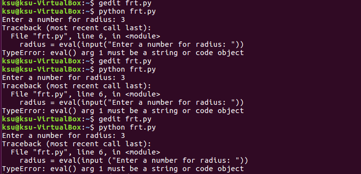
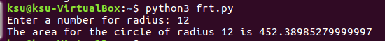
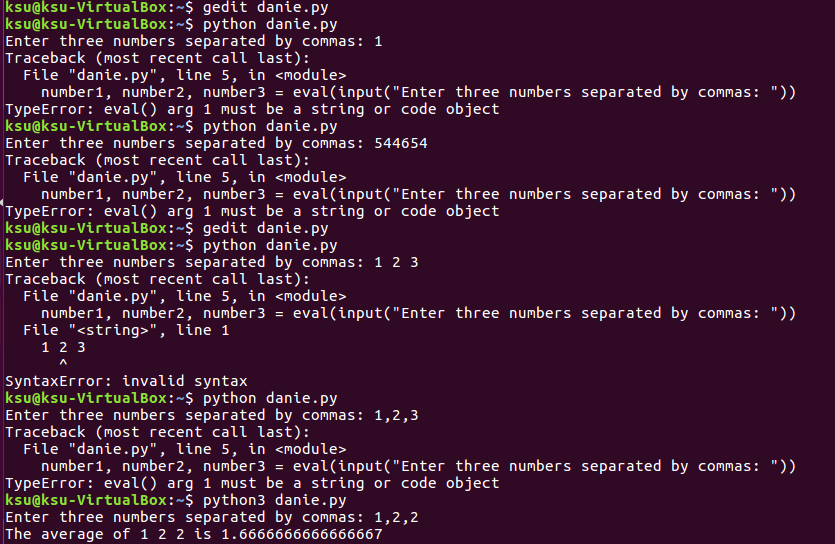
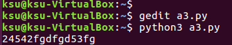
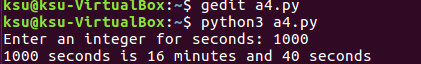
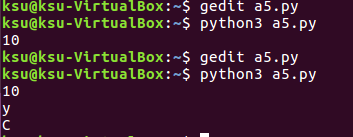

輸入和輸出
1.輸出
範例程式(圓面積)

```
#!/usr/bin/env python
#coding=utf-8

# radius = 25 
# Input:Prompt the user to enter a radius
radius = eval(input ("Enter a number for radius: "))

# Processin:Compute area
area = radius * radius * 3.1415962

# Output:Display results
print("The area for the circle of radius", radius, "is", area)
```



發現無法輸出 改使用python3



2.同時指定(Simultaneous Assignment )


範例程式(三數平均)


```
#!/usr/bin/env python
#coding=utf-8

# Prompt the user to enter three numbers
number1, number2, number3 = eval(input("Enter three numbers separated by commas: "))

# Compute average
average = (number1 + number2 + number3) / 3

# Display result
print("The average of", number1, number2, number3, "is", average)
```


一樣使用python3才能執行



3.Python 標準庫 隨意輸入


範例程式
```
#!/usr/bin/env python
#coding=utf-8

import sys
x = sys.stdin.read(5) 
```



Python程式設計(basic)
1.數字型(numeric)資料型態及其運算


範例程式(換算時間)
```
#!/usr/bin/env python
#coding=utf-8

seconds = eval(input("Enter an integer for seconds: "))

minutes = seconds // 60     # Find minutes in seconds
remainingSeconds = seconds % 60   # Seconds remaining
print(seconds, "seconds is", minutes, "minutes and", remainingSeconds, "seconds")
```



2.字串(string)資料型態及其運算
範例程式(輸入一個字串並分析)
```
string = ""
stringa = str()
id(string)
id(stringa)

stringb = str("MyfirstCTF")

string1 = "I love you"
print(len(stringb))
print(max(stringb))
print(min(stringb))
```
len =>字數

max =>最接近z的字母(abc..xyz)

min =>最接近a的字母


